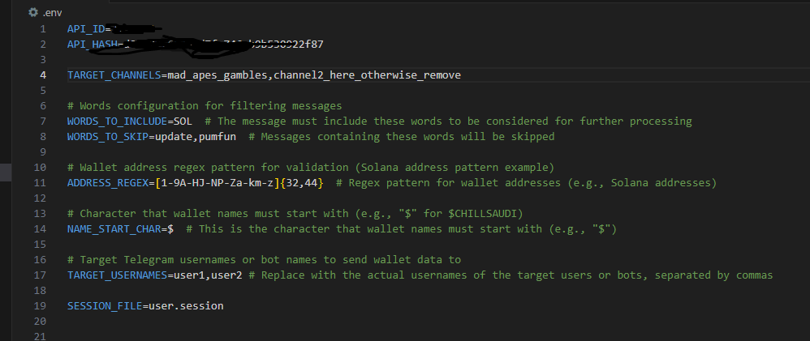

# RustTelegramHarvester

**RustTelegramHarvester** is a simple Telegram bot built in Rust that listens to specific Telegram channels, extracts wallet data (such as wallet addresses and names), and sends it to target users or bots. This bot can be configured to listen to multiple target Telegram channels and supports running in a highly efficient, asynchronous environment.

## Features
- Extract wallet addresses and names from messages in specific Telegram channels.
- Sends the extracted wallet information to target users or bots.
- Configurable session file, target channels, and usernames via a `.env` file.
- Asynchronous and fast processing with the `tokio` runtime.

## Prerequisites
Before running the bot, ensure that you have the following:
1. **Rust** installed on your machine. You can install Rust from [https://www.rust-lang.org/](https://www.rust-lang.org/).
2. **Telegram API credentials** (API ID and Hash). You can get these by registering your app on [Telegram's official site](https://my.telegram.org/auth).

## Compilation and Running

### 1. Clone the repository:
```bash
git clone https://github.com/Fizan324926/RustTelegramHarvester.git
cd RustTelegramHarvester
```

### 2. Install Dependencies:
Ensure you have Rust installed, then use the following commands to compile and run the project.

```bash
cargo build
cargo run
```
### 3. Set Up .env File:
The bot uses an .env file to store configuration settings such as your session file path, target channels, and usernames. The file should be placed in the root directory of the project.

To run the bot, make sure you have a valid .env file configured. If you don't already have one, you can create it by following the example below.

## Explanation of .env File
The .env file is used to configure various parameters such as the session file, target channels, and target usernames. Below is a description of each variable you need to set:

### 1. Example .env file:
  



Note: You need to ensure the channels you specify exist and that the bot has access to them. You also need to provide the target usernames of the users who will receive the messages containing wallet data.

## Running the Bot
Once your .env file is set up correctly and all dependencies are installed, run the following command to start the bot:

```bash
cargo run
```
The bot will:

Connect to the specified Telegram channels.
Extract wallet data from incoming messages.
Send the extracted data to the specified target users or bots.
